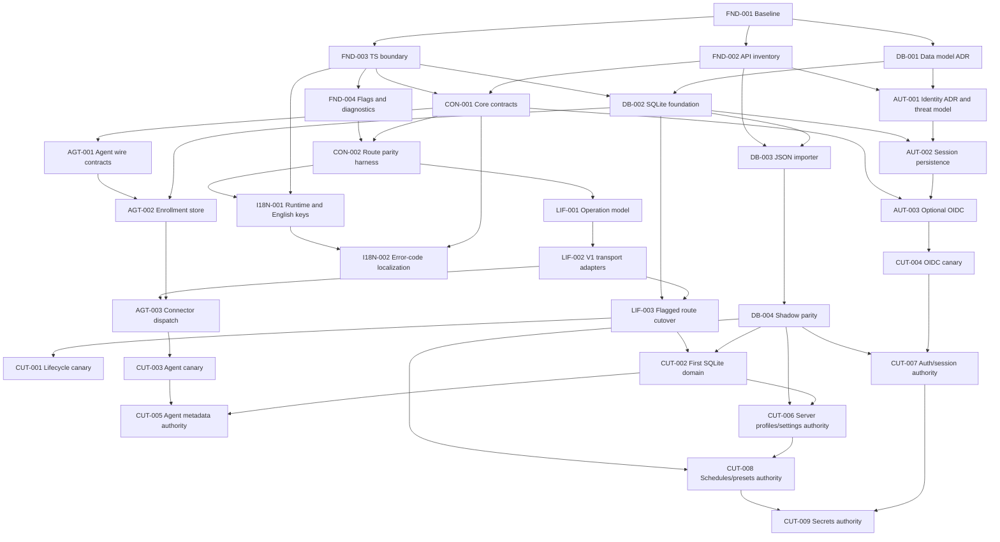

# V1 Modernization Plan

## Plan Control

| Field | Value |
| --- | --- |
| Plan version | 2.0 |
| Status | Execution-ready; implementation not started |
| Product baseline | V1 `v1.1.55`, commit `8642dc4` |
| Modernization fork | `D:\Projects\Zomboid_Control_Panel_Modernized` |
| V2 reference | `D:\Projects\Zomboid_dev_panel V2` |
| UI owner | V1 `client/` only |
| HTTP host | V1 Express `server/index.js` |
| Initial data authority | V1 `data/db.json` through lowdb |
| Deployment authority | User approval only |

This document is the canonical technical and execution specification. If an
agent discovers that the plan is wrong, it must record the discrepancy in a
decision record and stop at the current work-package boundary. It must not
silently reinterpret the architecture.

## Mission

Modernize the V1 control panel's backend and operational foundations using selected V2 ideas and implementations while preserving V1's existing React UI, routes, workflows, deployment behavior, and Project Zomboid integrations.

This is **not** a V2 migration and not a UI rewrite. V2 is a read-only reference implementation. The outcome is a stronger V1, not a hybrid product with two competing architectures.

## Local Repositories

| Role | Path | Rules |
| --- | --- | --- |
| V1 source, production reference | `D:\Zomboid_dev_panel\GitHub` | Read-only reference during this program. Do not change it from this fork's work. |
| Modernization fork | `D:\Projects\Zomboid_Control_Panel_Modernized` | All implementation work happens here. |
| V2 reference | `D:\Projects\Zomboid_dev_panel V2` | Read-only. Borrow patterns and code deliberately, never its UI. |

The modernization fork was cloned from V1 commit `8642dc4`, exactly tagged `v1.1.55`.

- The local clone remote is named `v1-source`, not `origin`, specifically to prevent accidental pushes.
- `data/db.json` was deliberately not copied. Never copy a live/runtime DB into the fork.
- Never deploy this fork to Tower until its parity and rollback gates are explicitly passed.
- Do not create branches, push, tag, publish, or deploy unless the user explicitly requests it.

## Product Contract

### Preserve

- V1 React UI, layout, navigation, URLs, page behaviors, and user vocabulary.
- V1 API endpoint paths, request shapes, response shapes, status codes, and client error semantics.
- V1's PanelBridge Lua integration, RCON operations, server-file management, Docker controls, backups, mod workflows, and existing recovery/login behavior.
- Existing installations, including their JSON database, secrets, server profiles, presets, schedules, and backups.

### Improve

- Typed validation and shared contracts at API boundaries.
- Authentication/session safety and optional OIDC.
- Structured operation/lifecycle state with locks, persistence, and truthful status transitions.
- Agent enrollment and host connector capability handling.
- SQLite-backed persistence after a tested import and parity phase.
- Incremental locale/error-key infrastructure.

### Do Not Do

- Do not import V2 pages, shell, navigation, visual system, or frontend layout.
- Do not make V2's API shape the public contract for V1 clients.
- Do not run V1 JSON persistence and SQLite as permanent co-authoritative stores.
- Do not let an agent replace PanelBridge or RCON without explicit capability parity.
- Do not cut over authentication, database, or lifecycle all at once.

## Target Shape

```text
V1 React UI and routes
        |
Existing V1 client API contract
        |
V1 Express route adapters
        |
Modern domain services and typed contracts
        |
+----------------+----------------+----------------+
| V1 JSON bridge | SQLite store   | Agent connector |
| during import  | after cutover  | optional        |
+----------------+----------------+----------------+
        |
PanelBridge / RCON / Docker / PZ server files / remote SFTP
```

The V1 Express app remains the HTTP host during the program. Modern domains are introduced behind V1 route adapters; a V1 screen should not require a backend rewrite merely because an implementation moves.

## Important V1 Anchors

| Concern | V1 path | Existing authority |
| --- | --- | --- |
| Express app and route registration | `server/index.js` | HTTP hosting, Socket.IO, middleware |
| JSON persistence | `server/database/init.js` | lowdb data and settings |
| Local auth | `server/services/auth.js`, `server/routes/auth.js` | Existing login, JWT/cookie/recovery behavior |
| Server lifecycle routes | `server/routes/server.js`, `server/routes/servers.js` | Start, stop, restart, server profiles |
| Lifecycle service | `server/services/serverManager.js` | Process detection and local launch/stop |
| RCON transport | `server/services/rcon.js` | Runtime game commands |
| PanelBridge transport | `server/services/panelBridge.js`, `pz-mod/PanelBridge/` | File bridge and game-only runtime actions |
| File/config routes | `server/routes/serverFiles.js` | INI/Sandbox/spawn/template writes |
| Current V1 UI shell | `client/src/App.tsx` | Must remain the visible application |
| Client API contract | `client/src/lib/api.ts` | Existing request/response assumptions |
| High-value UI routes | `client/src/pages/Dashboard.tsx`, `Servers.tsx`, `ServerConfig.tsx` | Must preserve behavior |

## Important V2 Reference Anchors

| Concern | V2 path | What to borrow |
| --- | --- | --- |
| Control-plane entry | `apps/control-plane/src/index.ts` | Composition and route/domain boundaries |
| OIDC | `apps/control-plane/src/oidc.ts` | Provider flow and callback handling |
| Local auth | `apps/control-plane/src/localAuth.ts` | Compatibility/fallback design |
| Cookie policy | `apps/control-plane/src/secureCookiePolicy.ts` | Session hardening rules |
| SQLite panel DB | `apps/control-plane/src/panelDatabase.ts` | Schema, transactions, migration style |
| Packaged data paths | `apps/control-plane/src/dataPaths.ts` | Durable Windows SEA/Linux/XDG data-root resolution |
| SQLite operations | `apps/control-plane/src/sqliteOperationStore.ts` | Operation persistence semantics |
| Lifecycle runner | `apps/control-plane/src/operationRunner.ts` | Operation orchestration |
| Lifecycle rules | `apps/control-plane/src/operationRules.ts` | Capability and safety decisions |
| Execution lock | `apps/control-plane/src/targetFeatureExecutionLock.ts` | Cross-operation exclusion |
| Target profiles | `apps/control-plane/src/targetProfiles.ts` | Typed target/server representation |
| Agent bootstrap | `apps/control-plane/src/localAgentBootstrap.ts` | Enrollment/bootstrap workflow |
| RCON connector | `apps/control-plane/src/rconConnector.ts` | Connector capability boundary |
| Shared contracts | `packages/contracts/src/` | Types, schemas, API vocabulary |
| V2 i18n | `apps/web/src/i18n.ts`, `apps/web/src/locales/` | Namespaced locale/error-key pattern |
| V2 UI | `apps/web/src/App.tsx`, `apps/web/src/api.ts` | Reference only. Do not port visuals or navigation. |

## Build Boundary

V1 is JavaScript/Express. V2 is a pnpm TypeScript workspace. Do not add V2 as a runtime dependency and do not turn V1 into a pnpm monorepo in the first phases.

Use this boundary instead:

1. Keep V1 `npm`/Node execution and the current Express entrypoint.
2. Add a small TypeScript-only modern-core build boundary inside the fork when the first typed domain needs it:
   - Source: `server/modern-src/`
   - Generated runtime ESM: `server/modern-runtime/`
   - Build config: `tsconfig.modern.json`
3. V1 Express adapters import generated ESM only. They never import V2 source paths at runtime.
4. Generated output is reproducible and covered by a build check. Do not hand-edit it.
5. V2 code may be ported, simplified, and adapted with tests. It is not vendored wholesale.

The first implementation task must prove this boundary with a tiny contract module and one V1 route adapter before larger domains are moved.

## Authority Matrix

| Capability | Current authority | Modernized rule |
| --- | --- | --- |
| Game runtime actions | RCON / PanelBridge | Keep authoritative. Agent may expose capability, never silently override. |
| Host process and files | V1 local filesystem / Docker | Agent becomes an optional transport for remote or non-local hosts. |
| Server configuration files | V1 server-files routes | Preserve stopped-server guard and atomic writes. |
| Panel metadata and operations | V1 lowdb initially | SQLite after migration/cutover. |
| User identity | V1 local auth | Local auth remains. OIDC is opt-in until proven. |
| Lua bridge state | PanelBridge | Never write Lua-owned cursor/state files from a new domain. |

Agent capability precedence must be explicit:

1. Use direct local V1 implementation when it is safe and available.
2. Use an enrolled agent only for capabilities it advertises and the target grants.
3. Use PanelBridge/RCON for PZ-specific runtime commands.
4. Return a clear unsupported capability result. Never report success after a fallback silently did nothing.

## Phased Program

### Phase 0: Fork Baseline and Contract Inventory

**Goal:** establish a reproducible starting point and the public behavior that cannot regress.

Tasks:

- Record V1 baseline tag, Node/npm versions, supported runtime modes, and deployment layout.
- Build an endpoint inventory from `server/index.js`, all `server/routes/`, and `client/src/lib/api.ts`.
- For high-risk endpoints, capture request/response/status-code fixtures:
  - auth status/login/refresh/logout
  - server profiles and active server
  - lifecycle start/stop/restart/status
  - server files INI/Sandbox
  - PanelBridge and RCON status
  - backups, scheduler, mods
- Add route-contract tests before replacing implementations.
- Create `docs/modernization/` for decision records, import reports, parity results, and rollback instructions.

Exit gate:

- V1 test suite, client build, and a saved API contract inventory are green.
- No functional code change yet.

### Phase 1: Typed Contracts and Validation

**Goal:** strengthen inputs and outputs without changing V1 behavior.

Tasks:

- Port the minimum V2 contract patterns from `@zomboid-panel/contracts` into `server/modern-src/contracts/`.
- Start with server profiles, lifecycle operations, auth session summaries, and connector capabilities.
- Validate route input at adapters while returning V1-compatible errors.
- Add runtime schema validation for data arriving from agent/PanelBridge/RCON boundaries.
- Preserve V1 client `client/src/lib/api.ts` types until a route has parity tests.

Exit gate:

- Existing V1 API fixtures remain byte/shape compatible where intended.
- Invalid input is rejected consistently instead of being coerced or ignored.
- No UI changes are required except clearer existing error text where V1 already displays it.

### Phase 2: Lifecycle Operation Core

**Goal:** replace scattered lifecycle state with a single truthful operation model.

Tasks:

- Port V2 ideas from `operationRules`, `operationRunner`, `operationStore`, and `targetFeatureExecutionLock`.
- Start with a V1 adapter over the current `serverManager`, `rcon`, managed Docker, and PanelBridge services.
- Model `start`, `stop`, `force-stop`, `restart`, `save`, and config mutation preconditions explicitly.
- Persist operation state and expose it through existing V1 status routes without changing their response contract.
- Keep V1 Socket.IO event names and payloads stable.
- Add lock coverage: stop versus start, update versus restart, restore versus config save, concurrent lifecycle clicks.

Exit gate:

- Dashboard and Servers UI show confirmed state transitions, not optimistic guesses.
- Every operation has idempotency, timeout, cancellation/failure state, audit event, and truthful result handling.
- RCON `save` before `quit`, zero-player checks, and Java/process confirmation remain mandatory for full container updates.

### Phase 3: SQLite Import and Shadow Verification

**Goal:** gain structured persistence without risking a JSON big-bang.

Tasks:

- Port V2 SQLite patterns from `panelDatabase` and `sqliteOperationStore` into V1 modern-core.
- Define SQLite tables for profiles, settings, operations, audit events, auth metadata, connector enrollment, and migration metadata.
- Write a transactional, idempotent importer from V1 `data/db.json`.
- Store import source hash, timestamp, record counts, and per-record validation results.
- Add a read-only parity command that compares normalized JSON values to SQLite values.
- Initially keep JSON authoritative. SQLite receives import snapshots and operation data only.
- Take a backup before every import. Never overwrite `data/db.json`.

Secret rules:

- Preserve current behavior first.
- Use V2 `secretResolver`/database patterns only after a reviewed secret migration plan exists.
- Do not log plaintext tokens, passwords, recovery codes, session material, or RCON passwords.

Cutover gate:

- At least three clean imports from representative DBs.
- JSON/SQLite parity report has no unexplained differences.
- Recovery/rollback restores the prior JSON-backed runtime in one command.
- Only then choose one authoritative store per domain. No permanent dual-write.

### Phase 4: Agent Enrollment and Connector Transport

**Goal:** add V2's host-agent strengths while preserving V1's local, PanelBridge, RCON, SFTP, and Docker workflows.

Tasks:

- Port V2 target-profile and agent enrollment concepts from `targetProfiles`, `localAgentBootstrap`, and connector modules.
- Add agent registration as an optional V1 server transport, not a new mandatory server type.
- Map V1 server fields to modern target fields through one explicit adapter.
- Create a capability matrix per target: local filesystem, agent files, RCON, PanelBridge, SFTP, Docker, lifecycle, backups, workshop scan.
- Require capability checks before every operation. Return V1-compatible clear errors when unsupported.
- Add enrollment token expiry, one-time use, rotation/revocation, audit events, TLS/host validation, and explicit target ownership checks.

Exit gate:

- A V1 screen behaves identically with no agent.
- An agent-enabled target can perform only advertised actions.
- PanelBridge/RCON remain preferred for game runtime commands.
- All agent operations have contract, auth, timeout, and disconnect tests.

### Phase 5: Optional OIDC and Session Modernization

**Goal:** add OIDC without breaking standalone installs or current user access.

Tasks:

- Port V2 OIDC/cookie patterns from `oidc`, `localAuth`, and `secureCookiePolicy` behind existing V1 auth routes.
- Keep V1 local admin/password/recovery flow as the default fallback.
- Make OIDC disabled by default and explicitly configured by environment/settings.
- Maintain local emergency access with documented recovery behavior.
- Map V2 identity claims to V1 roles without widening privileges.
- Add safe account linking rules, nonce/state/PKCE validation, logout behavior, token refresh, clock-skew handling, and cookie security tests.

Exit gate:

- Existing local login remains unaffected when OIDC is disabled.
- OIDC login, refresh, logout, recovery, and authorization tests all pass.
- No session secret or identity token appears in responses, logs, events, debug bundles, or browser storage.

### Phase 6: Locale and Error-Key Infrastructure

**Goal:** add V2's localization foundation while retaining V1 visual design and wording style.

Tasks:

- Port V2 `i18n.ts`, locale merge pattern, and key coverage tests.
- Start with shell, auth, errors, lifecycle, setup, and server status text.
- Keep a temporary English fallback for every missing key.
- Move errors from prose-only backend strings to stable error codes plus localized client text.
- Add locale coverage and raw-machine-value guards before expanding to every page.

Exit gate:

- English V1 UI remains visually unchanged.
- Missing locale keys fail tests, not production rendering.
- Backend errors remain meaningful for API users even without the frontend.

### Phase 7: Domain-by-Domain Persistence Cutover

**Goal:** move only proven domains from JSON to SQLite.

Recommended order:

1. `CUT-002`: operations and audit events
2. `CUT-005`: agent enrollment and connector metadata
3. `CUT-006`: server profiles and non-secret settings
4. `CUT-007`: auth/session metadata
5. `CUT-008`: schedules, presets, templates, and UI metadata
6. `CUT-009`: secrets only after separate recovery and encryption review

For every domain:

- Import and compare.
- Enable read-from-SQLite behind a feature flag.
- Keep a tested rollback to JSON.
- Remove legacy writes only after sustained parity.

## Feature Flags

All modernized domains must be independently reversible.

Suggested flags:

```text
MODERN_CONTRACTS_ENABLED=false
MODERN_LIFECYCLE_ENABLED=false
MODERN_SQLITE_IMPORT_ENABLED=false
MODERN_SQLITE_READS_ENABLED=false
MODERN_AGENT_ENABLED=false
MODERN_OIDC_ENABLED=false
MODERN_I18N_ENABLED=false
```

Flags are defaults only. The plan must specify where they are loaded, how they are surfaced in Debug, and what fallback each one uses.

## API Compatibility Rules

Before replacing a route implementation:

1. Capture the V1 route's request and response fixtures.
2. Preserve endpoint path, method, auth expectation, response field names, status codes, and Socket.IO events.
3. Add adapter tests that compare old and modernized implementation output.
4. Add a feature-flag fallback test.
5. Replace the implementation only after contract parity passes.

A route may add optional fields, but it must not silently remove, rename, or reinterpret a V1 field consumed by the current UI.

## Database Migration Rules

- Never modify or delete `data/db.json` during import.
- Back up JSON before each import with source hash metadata.
- Import must be transactional, resumable, idempotent, and dry-run capable.
- Secrets must be redacted from import reports.
- Every import report includes totals for imported, skipped, invalid, and conflicting records.
- Do not use lowdb and SQLite as concurrent writers for the same record type.
- New DB runtime state must have startup backup, migration version, integrity check, and rollback command.

## Agent and PanelBridge Rules

- Agent is a host/control transport. PanelBridge is the game-file bridge. RCON is the live game command transport.
- Never allow multiple transports to independently mutate the same PZ setting without an operation lock and a declared authority.
- PanelBridge Lua versioning remains coupled to `mod.info` and the Lua `VERSION` constant.
- Lua writes only allowed files. Preserve V1's `commands.json`/cursor ownership rules.
- Agent enrollment must not bypass V1's authorization or target scoping.

## Test and Quality Gates

Run at the beginning and end of every phase:

```powershell
npm run test:server
npm run lint:server
Push-Location client
npx vitest run
& .\node_modules\.bin\tsc.cmd -b --pretty false
npm run build
Pop-Location
git diff --check
```

Additional mandatory gates by domain:

| Domain | Required evidence |
| --- | --- |
| Contracts | Route fixture/parity tests |
| Lifecycle | Concurrent action/timeout/lock tests plus UI status test |
| SQLite | Import fixture, idempotency, parity report, rollback rehearsal |
| Agent | Enrollment/revocation/capability/timeout tests |
| OIDC | Callback/state/nonce/PKCE/role/logout/recovery tests |
| i18n | Locale key coverage, English fallback, error-key mapping tests |

Before any Tower deployment:

1. Compare local package version to `/app/package.json` in the container.
2. Compare server markers/checksums, not only client asset hashes.
3. Treat package/server drift as a full deployment.
4. For server-code changes: confirm zero players, RCON `save`, RCON `quit`, Java count `0`, restart, and post-restart health/marker/RCON verification.
5. Back up every overwritten Tower file. Never touch `data/db.json`.

## Milestone Acceptance Criteria

### M1: Foundation

- Fork builds and passes current V1 gates.
- Contract inventory exists.
- Modern TypeScript boundary builds and is unused by default.

### M2: Lifecycle

- V1 UI controls behave identically.
- Modern lifecycle feature flag has exhaustive parity and rollback tests.
- No duplicate lifecycle operation can run concurrently.

### M3: SQLite Shadow

- Import is repeatable, secret-safe, and parity-clean.
- JSON remains authoritative.

### M4: Agent

- Agent enrollment is optional, capability-scoped, and auditable.
- No-agent V1 hosts remain fully functional.

### M5: OIDC and i18n

- OIDC is opt-in with local recovery unaffected.
- English V1 UI remains visually unchanged; locale infrastructure has coverage.

### M6: Selected SQLite Cutover

- One domain at a time is SQLite-authoritative with proven rollback.
- No permanent dual-write exists.

## Risks and Mitigations

| Risk | Mitigation |
| --- | --- |
| JSON to SQLite loses data/secrets | Transactional dry-run importer, backups, parity reports, rollback before read cutover |
| V2 agent conflicts with PanelBridge/RCON | Explicit authority matrix, capability routing, locks, fallback tests |
| V1 client breaks due to route drift | Contract fixtures, adapter layer, optional fields only |
| OIDC locks out a local owner | Opt-in rollout, local auth retained, recovery path tested |
| TypeScript build boundary becomes a second app | Keep it small, compile to ESM, V1 Express remains the only HTTP host |
| Modernization fork accidentally reaches Tower | Separate directory, no `origin`, feature flags, explicit user approval required |
| AI applies V2 UI by accident | Treat V2 frontend as behavior/i18n reference only; V1 client owns all visible UI |

## Default Decisions

These defaults avoid blocking the program. Change them only with an explicit user decision.

- Start from V1 `v1.1.55` in this local fork.
- Keep V1 UI and Express route surface.
- OIDC is optional; local auth stays enabled.
- Agent is optional; no-agent and remote SFTP workflows stay supported.
- SQLite begins in shadow/import mode; JSON remains authoritative until explicit cutover.
- Use V1 API fixtures as the compatibility definition.
- Do not deploy the fork to Tower during Phases 0-2.
- Do not create a remote repository or push the fork without authorization.

## Autonomous Agent Execution Specification

This section is normative. It defines how a coordinator agent and subagents
must execute the program. The earlier sections explain the architecture; this
section controls the work.

### Definition of Program Success

The modernization is successful only when all of the following are true:

1. The visible product is still V1. Existing routes, page layouts, workflows,
         navigation, vocabulary, and responsive behavior remain recognizable and
         compatible.
2. Existing V1 installations can start without migration, use local auth, and
         control their current local/remote servers exactly as before.
3. Every modernized backend domain has a feature flag, a tested fallback, an
         evidence package, and a rollback procedure.
4. SQLite can import representative V1 databases with no unexplained parity
         differences and without modifying the source JSON file.
5. Agent support is optional and capability-scoped. RCON and PanelBridge retain
         their game-runtime authority.
6. OIDC is optional. Disabling it leaves the existing local login and recovery
         path fully functional.
7. English V1 rendering remains the default. Locale infrastructure does not
         redesign or restructure the UI.
8. The full V1 test suite, new domain tests, API parity tests, migration tests,
         and release build all pass from a clean checkout.
9. A rollback rehearsal proves that the last production V1 release can be
         restored without data loss.

### Coordinator and Subagent Roles

One coordinator agent owns sequencing and integration. Subagents may research
or implement bounded work packages, but they do not control the program.

| Role | Allowed work | Required output | Forbidden |
| --- | --- | --- | --- |
| Coordinator | Select work packages, assign ownership, integrate, run final gates | Updated status ledger and accepted evidence | Skipping dependencies or gates |
| Discovery agent | Read-only code/history analysis | Exact paths, symbols, contracts, risks | Editing files or proposing unrelated refactors |
| Contract agent | API fixtures, schemas, adapters, parity tests | Contract artifacts and test results | Changing route behavior without approval |
| Domain agent | One assigned modern domain in an isolated worktree | Code, tests, rollback note, evidence package | Editing another agent's owned paths |
| Data migration agent | SQLite schema/import/parity tooling | Dry-run report, idempotency proof, rollback proof | Modifying source `db.json` |
| Security reviewer | Threat model, auth/secret review, abuse tests | Findings ordered by severity | Implementing around unresolved critical findings |
| Verification agent | Independent tests, fault injection, parity review | Reproducible commands and results | Repairing failures without returning ownership |
| UI parity reviewer | Screenshots and workflow comparison | V1-before/modernized-after evidence | Porting V2 UI or changing design language |

### Repository and Worktree Rules

1. The coordinator works in
         `D:\Projects\Zomboid_Control_Panel_Modernized`.
2. Concurrent implementation agents must use separate worktrees under
         `D:\Projects\ZCP-Modernized-worktrees\<WP-ID>` and local branches named
         `modern/<wp-id-lowercase>`.
3. Two agents must never edit the same file concurrently. Shared files such as
         `package.json`, lockfiles, `server/index.js`, feature-flag registration, and
         this plan are coordinator-owned.
4. Discovery and verification agents are read-only unless the coordinator
         explicitly returns a failed work package to them as its new owner.
5. Subagents do not commit, push, tag, publish, deploy, or touch Tower. Local
         checkpoint commits require explicit user authorization.
6. V1 source and V2 reference paths are read-only. All copied code is adapted
         into the modernization fork and attributed in the decision/evidence record
         by source path and source commit.
7. Never copy `data/db.json`, logs, build output, release output, browser traces,
         credentials, or runtime backups into a worktree.

### Canonical Program Artifacts

Phase 0 must create and maintain these files:

```text
docs/modernization/
        README.md
        STATUS.md
        STATUS_ARCHIVE.md
        WORK_PACKAGES.md
        DECISIONS.md
        RISK_REGISTER.md
        API_CONTRACT_INVENTORY.md
        DATA_MAPPING.md
        CAPABILITY_MATRIX.md
        THREAT_MODEL.md
        ROLLBACK.md
        evidence/
                <WP-ID>/
                        SUMMARY.md
                        COMMANDS.md
                        RESULTS.json
                        DIFF_SCOPE.md
                        ROLLBACK.md
                        PROVENANCE.md
                        VERIFICATION.md
        templates/
                ADR_TEMPLATE.md
                API_CONTRACT_RECORD_TEMPLATE.md
                BASELINE_TEMPLATE.md
                CAPABILITY_MATRIX_TEMPLATE.md
                COMMANDS_TEMPLATE.md
                DECISIONS_INDEX_TEMPLATE.md
                DECISION_REQUEST_TEMPLATE.md
                DIFF_SCOPE_TEMPLATE.md
                EVIDENCE_SUMMARY_TEMPLATE.md
                FIXTURE_MANIFEST_TEMPLATE.md
                PERF.schema.json
                PHASE_REVIEW_CHECKLIST.md
                PROVENANCE_TEMPLATE.md
                PROGRAM_README_TEMPLATE.md
                PROGRAM_ROLLBACK_TEMPLATE.md
                RESULTS.schema.json
                RISK_REGISTER_TEMPLATE.md
                ROLLBACK_MANIFEST_TEMPLATE.md
                STATUS_ARCHIVE_TEMPLATE.md
                STATUS_TEMPLATE.md
                VERIFICATION_TEMPLATE.md
                WORK_PACKAGES_LEDGER_TEMPLATE.md
                WORK_PACKAGE_TEMPLATE.md
```

Execution procedures live at:

```text
docs/modernization/INTEGRATION_PROCEDURE.md
docs/modernization/WORKTREE_LIFECYCLE.md
docs/modernization/CONFLICT_RESOLUTION.md
scripts/modernization/bootstrap-plan.ps1
scripts/modernization/validate-handoff.ps1
scripts/modernization/initialize-program.ps1
scripts/modernization/new-work-package.ps1
scripts/modernization/create-worktree.ps1
scripts/modernization/copy-package-template.ps1
scripts/modernization/check-owned-paths.ps1
scripts/modernization/validate-evidence.mjs
scripts/modernization/measure-baseline.mjs
```

### Artifact Responsibilities

| Artifact | Single purpose |
| --- | --- |
| `README.md` | Program entry point, directory map, and resume instructions |
| `STATUS.md` | Bounded current state and next exact action |
| `STATUS_ARCHIVE.md` | Closed/accepted package history moved out of STATUS |
| `WORK_PACKAGES.md` | Package ledger, dependencies, ownership, state, evidence links |
| `DECISIONS.md` | ADR index and current/superseded decision status |
| `RISK_REGISTER.md` | Scored active/resolved program risks |
| `API_CONTRACT_INVENTORY.md` | V1 route/event compatibility definition |
| `DATA_MAPPING.md` | V1 JSON to modern schema normalization/cutover map |
| `CAPABILITY_MATRIX.md` | Human-readable target/connector capability authority |
| `THREAT_MODEL.md` | Security assets, boundaries, threats, mitigations, residual risks |
| `ROLLBACK.md` | Program recovery entry point linking package manifests |
| `evidence/<WP-ID>/` | Immutable package-specific proof and rollback material |

Templates are copied, never edited in place. FND-001 instantiates the program
ledgers. Each package instantiates `SUMMARY.md`, `RESULTS.json`, `ROLLBACK.md`,
and `VERIFICATION.md`; packages adapted from V2 also instantiate
`PROVENANCE.md`.

`STATUS.md` is the resumption source after context compaction. It must contain:

- baseline commit and current branch/worktree;
- active work package, owner, state, and dependencies;
- last successful full gate with counts;
- modified paths and reserved paths;
- unresolved blockers and next exact command;
- latest accepted decision record IDs.

`STATUS.md` uses the supplied template, stays under 250 lines, and keeps only
the latest three accepted packages. Older package summaries move to
`STATUS_ARCHIVE.md`; detailed evidence remains in its immutable package folder.

ADR IDs are `ADR-<WP-ID>-<NN>`, for example `ADR-DB-002-01`.
`DECISIONS.md` reserves/indexes ID, title, status, work package, date, and path.
Risk IDs are monotonic `RISK-<NNN>` and use the checked-in 1-5 likelihood/impact
scoring template.

Work-package states are:

```text
planned -> ready -> active -> review -> accepted
                           -> blocked
                           -> rejected -> ready
blocked --coordinator resolves--> ready
blocked --coordinator abandons--> rejected
```

Only the coordinator changes a work package to `accepted`, returns a blocked
package to `ready`, or rejects/abandons blocked work.

### Per-Work-Package Protocol

Every work package follows this sequence:

1. **Preflight**: verify baseline, clean/known worktree, dependencies accepted,
         owned paths free, and feature disabled by default.
2. **Contract statement**: write the behavior that must stay unchanged and the
         new behavior being introduced.
3. **Cheapest falsifier**: identify one focused test that can disprove the
         implementation hypothesis.
4. **Small first edit**: implement the smallest vertical slice.
5. **Immediate focused validation**: run the falsifier before widening scope.
6. **Implementation**: complete only the declared package.
7. **Fault tests**: timeout, malformed input, unavailable transport, duplicate
         request, interrupted write, restart, and rollback where applicable.
8. **Full owned-domain gate**: run all tests for touched domains.
9. **Evidence**: write commands, results, diff scope, known risks, and rollback.
10. **Independent review**: a different agent verifies the package without
                editing it.
11. **Coordinator acceptance**: integrate only when all exit criteria pass.

An agent must stop and mark `blocked` when it encounters an unresolved contract
change, data-loss risk, secret exposure, authority conflict, or a required edit
to another active agent's files.

A package blocked during read-only preflight may record zero commands in
`RESULTS.json`, but must supply `blocked_reason`. Passed/failed outcomes require
at least one recorded command; agents never fabricate placeholder commands.

## Dependency Graph



Safe initial parallelism:

- After `FND-001`, `FND-002`, `FND-003`, and `DB-001` may run in parallel in
        separate worktrees.
- `AUT-001` may begin after the API inventory and data ADR exist.
- `I18N-001` may run only after the Foundation/contract review accepts
        `CON-002`; it must not edit page components while another UI package owns
        them.
- Lifecycle, database cutover, agent dispatch, and auth cutover are never
        parallelized against shared route registration or shared persistence files.

## Work-Package Catalog

### Foundation and Contracts

| ID | Depends on | Primary owned paths | Deliverable and exit gate |
| --- | --- | --- | --- |
| FND-001 | none | `docs/modernization/{README,STATUS,STATUS_ARCHIVE,WORK_PACKAGES,DECISIONS,RISK_REGISTER,BASELINE,ROLLBACK}.md`, `scripts/modernization/{bootstrap-plan.ps1,validate-handoff.ps1,initialize-program.ps1,new-work-package.ps1,create-worktree.ps1,copy-package-template.ps1,check-owned-paths.ps1,validate-evidence.mjs,measure-baseline.mjs}`, `docs/modernization/evidence/FND-001/**` | Baseline commands, versions, route count, DB shape, supported deployment modes, performance sample, program rollback skeleton; clean full V1 gate |
| FND-002 | FND-001 | `docs/modernization/API_CONTRACT_INVENTORY.md`, `scripts/modernization/{inventory-api,capture-fixtures}.mjs`, `server/tests/contract-fixtures/**`, `docs/modernization/evidence/FND-002/**` | Inventory every `/api` route and Socket.IO event; high-risk golden fixtures accepted |
| FND-003 | FND-001 | `server/modern-src/proof.ts`, `server/tests/modernBuild.test.js`, `tsconfig.modern.json`, `scripts/build-modern.mjs`, coordinator-owned package scripts/lockfile, `docs/modernization/evidence/FND-003/**` | Reproducible TS-to-ESM proof with no production route enabled |
| FND-004 | FND-003 | `server/modern-src/flags/**`, `server/tests/modernFlags.test.js`, coordinator integration hunk in `server/routes/debug.js`, `docs/modernization/evidence/FND-004/**` | Typed flag registry, environment parsing, startup diagnostics, all defaults false |
| CON-001 | FND-002, FND-003 | `server/modern-src/contracts/**`, `server/tests/modernContracts/**`, `docs/modernization/evidence/CON-001/**` | Minimum copied/adapted contracts for profiles, operations, auth status, capability snapshots |
| CON-002 | CON-001, FND-004 | `server/modern-src/adapters/contractParity.ts`, `server/tests/contractParity/**`, `scripts/modernization/verify-contract-fixtures.mjs`, `docs/modernization/evidence/CON-002/**` | Legacy versus modern output comparator; flag-on and flag-off fixtures match |

Broad directory ownership is never retained implicitly. `FND-003` creates only
the listed proof/build files; after acceptance, each `server/modern-src/`
subdirectory is owned by its catalog package. `server/modern-runtime/**` is
generated output, not an implementation ownership claim.

### Lifecycle

| ID | Depends on | Primary owned paths | Deliverable and exit gate |
| --- | --- | --- | --- |
| LIF-001 | CON-002 | `server/modern-src/lifecycle/model/**`, `server/tests/modernLifecycle/model/**`, `docs/modernization/evidence/LIF-001/**` | Operation states, transitions, idempotency fingerprint, lock keys, failure taxonomy; in-memory test store only |
| LIF-002 | LIF-001 | `server/modern-src/lifecycle/adapters/**`, `server/tests/modernLifecycle/adapters/**`, `docs/modernization/evidence/LIF-002/**` | Adapters over V1 serverManager, RCON, Docker, PanelBridge; no route switch |
| LIF-003 | LIF-002, DB-002 | `server/modern-src/lifecycle/routeAdapter.ts`, coordinator-owned hunks in `server/routes/{server,servers,serverStatus}.js` and `server/index.js`, `server/tests/modernLifecycle/routes/**`, `docs/modernization/evidence/LIF-003/**` | Durable SQLite operation store plus feature-flagged start/stop/restart path preserving V1 responses/events |
| CUT-001 | LIF-003 | `docs/modernization/evidence/CUT-001/**`, canary-only config outside production defaults | Local canary, failure injection, flag rollback, UI parity screenshots |

### SQLite

| ID | Depends on | Primary owned paths | Deliverable and exit gate |
| --- | --- | --- | --- |
| DB-001 | FND-001 | `docs/modernization/{DATA_MAPPING,ADR-DB-001}.md`, `server/tests/fixtures/modernization/**`, `docs/modernization/evidence/DB-001/**` | Approved table/data-path design, secret exclusions, per-collection migration order |
| DB-002 | DB-001, FND-003 | `server/modern-src/persistence/core/**`, `server/tests/modernPersistence/core/**`, coordinator-owned dependency/build files, `docs/modernization/evidence/DB-002/**` | Durable data-path resolver, WAL SQLite open/migrate/integrity/backup/compact helpers, native packaging spike |
| DB-003 | DB-002, FND-002 | `server/modern-src/persistence/import/**`, `scripts/modernization/import-json-to-sqlite.mjs`, import tests, `docs/modernization/evidence/DB-003/**` | Dry-run and apply importer, source hash, transaction, idempotency, redacted report |
| DB-004 | DB-003 | `server/modern-src/persistence/parity/**`, `scripts/modernization/compare-json-sqlite.mjs`, parity tests/reports, `docs/modernization/evidence/DB-004/**` | Normalized JSON/SQLite diff with zero unexplained differences on 3 fixtures |
| CUT-002 | DB-004, LIF-003 | `server/modern-src/persistence/repositories/operations/**`, operation repository adapter tests, `docs/modernization/evidence/CUT-002/**` | Operations/audit becomes first SQLite-authoritative domain with flag rollback |

### Agent and Connectors

| ID | Depends on | Primary owned paths | Deliverable and exit gate |
| --- | --- | --- | --- |
| AGT-001 | CON-001 | `server/modern-src/connectors/contracts/**`, connector contract tests, `docs/modernization/CAPABILITY_MATRIX.md`, `docs/modernization/evidence/AGT-001/**` | Pinned V2 wire contract snapshot, version negotiation, capability snapshot parser |
| AGT-002 | AGT-001, DB-002 | `server/modern-src/connectors/enrollment/**`, coordinator-owned enrollment route hunk, enrollment tests, `docs/modernization/evidence/AGT-002/**` | Hashed one-time enrollment tokens, expiry, revocation, target binding, audit |
| AGT-003 | AGT-002, LIF-002 | `server/modern-src/connectors/dispatch/**`, connector dispatch tests, coordinator-owned composition hunk, `docs/modernization/evidence/AGT-003/**` | Deterministic authority/capability routing with no silent fallback |
| CUT-003 | AGT-003 | `docs/modernization/evidence/CUT-003/**`, isolated agent fixture/config | Disconnect, stale capability, refused action, timeout, replay, and no-agent parity |

### Authentication and Locale

| ID | Depends on | Primary owned paths | Deliverable and exit gate |
| --- | --- | --- | --- |
| AUT-001 | FND-002, DB-001 | `docs/modernization/{ADR-AUTH-001,THREAT_MODEL}.md`, auth abuse tests, `docs/modernization/evidence/AUT-001/**` | Claim/role/linking/recovery/cookie decisions and abuse cases approved |
| AUT-002 | AUT-001, DB-002 | `server/modern-src/auth/session/**`, session repository/adapters/tests, `docs/modernization/evidence/AUT-002/**` | Hashed refresh sessions, revocation, rotation, current V1 local auth parity |
| AUT-003 | AUT-002, CON-001 | `server/modern-src/auth/oidc/**`, coordinator-owned hunks in `server/routes/auth.js` and `server/index.js`, OIDC tests, `docs/modernization/evidence/AUT-003/**` | Discovery, state, nonce, PKCE, callback, logout, issuer-subject identity mapping |
| CUT-004 | AUT-003 | `docs/modernization/evidence/CUT-004/**`, opt-in canary config | OIDC canary plus verified local break-glass login and one-command disable |
| I18N-001 | FND-003, CON-002 | `client/src/i18n/**`, `client/src/locales/en/**`, locale runtime/tests, `docs/modernization/evidence/I18N-001/**` | Runtime, namespace loader, English fallback, key coverage, no visual change; begins only after Foundation review |
| I18N-002 | I18N-001, CON-001 | `client/src/i18n/errorCodes.ts`, selected locale error files, explicitly reserved page hunks, error-key tests, `docs/modernization/evidence/I18N-002/**` | Stable backend codes mapped to localized client text; raw errors remain API-usable |

### Later Persistence Cutovers

| ID | Depends on | Primary owned paths | Deliverable and exit gate |
| --- | --- | --- | --- |
| CUT-005 | CUT-002, CUT-003 | `server/modern-src/persistence/repositories/agents/**`, enrollment repository adapter/tests, `docs/modernization/evidence/CUT-005/**` | Agent enrollment and connector metadata become SQLite-authoritative; revoke/rollback proven |
| CUT-006 | CUT-002, DB-004 | `server/modern-src/persistence/repositories/profiles/**`, coordinator-owned DB adapter hunk in `server/database/init.js`, profile/settings parity tests, `docs/modernization/evidence/CUT-006/**` | Server profiles and approved non-secret settings become SQLite-authoritative with V1 response parity |
| CUT-007 | CUT-004, DB-004 | `server/modern-src/persistence/repositories/auth/**`, auth repository adapter/tests, `docs/modernization/evidence/CUT-007/**` | Users/session metadata becomes SQLite-authoritative while local recovery remains proven |
| CUT-008 | CUT-006, DB-004 | `server/modern-src/persistence/repositories/{schedules,presets,ui}/**`, domain parity tests, `docs/modernization/evidence/CUT-008/**` | Schedules, presets, templates/UI metadata cut over one repository at a time |
| CUT-009 | CUT-007, CUT-008 | `server/modern-src/persistence/secrets/**`, coordinator-owned secret adapter hunks, security/rollback tests, `docs/modernization/evidence/CUT-009/**` | Secrets cut over only after approved encryption/reference ADR and recovery rehearsal |

## Target Fork Layout

The target structure should converge toward this without moving the existing
V1 UI or Express host:

```text
client/
        src/
                i18n/                     # added incrementally; V1 pages stay in place
server/
        index.js                    # remains the only HTTP composition root
        routes/                     # V1 route paths and response adapters
        services/                   # current V1 implementations/fallbacks
        modern-src/
                contracts/
                flags/
                lifecycle/
                persistence/
                connectors/
                auth/
                observability/
        modern-runtime/             # generated ESM, never hand-edited
scripts/
        modernization/
                inventory-api.mjs
                import-json-to-sqlite.mjs
                compare-json-sqlite.mjs
                verify-contract-fixtures.mjs
docs/
        modernization/
```

Do not create a second HTTP server, a second React app, or a permanent runtime
dependency on `D:\Projects\Zomboid_dev_panel V2`.

## API Contract Parity Specification

### Inventory Record

Every V1 route inventory row must capture:

| Field | Meaning |
| --- | --- |
| method/path | Exact public endpoint |
| route owner | Express route file and handler symbol/line |
| auth | Public, authenticated, or required role |
| limiter | Global, login, strict, or custom |
| request | Params/query/body schema and size limits |
| success | Status, content type, JSON shape, optional fields |
| errors | Status, `code`, `error`, retry semantics |
| side effects | DB writes, file writes, RCON, PanelBridge, Docker, events |
| socket events | Event names and payload shapes |
| client consumers | `client/src/lib/api.ts` method and pages |
| fixture | Golden fixture path and normalization rules |

### Golden Fixture Rules

- Scrub only nondeterministic values: IDs, timestamps, temp paths, PIDs, ports,
        hashes, and platform separators.
- Do not scrub missing fields, null-versus-undefined behavior, status codes,
        array ordering, booleans, or error codes.
- Record headers that affect auth/caching/cookies.
- Store no plaintext secrets. Replace them with typed placeholders before a
        fixture reaches disk.
- Compare modern and legacy handlers through the same Express request harness.
- Socket.IO events require event-name and payload fixtures.

### Error Compatibility

Modern implementations may add a stable `code` and optional safe `details`,
but must preserve V1's status and `error` message until every current client
consumer has migrated. Never convert an operational failure into HTTP 200.

## Lifecycle Operation Specification

Use V2's operation vocabulary as the internal model:

```text
accepted -> running -> waiting -> running
accepted -> cancelled
running  -> succeeded | failed | cancelled
waiting  -> succeeded | failed | cancelled
```

Terminal states are immutable. Every transition is validated and appended as
an operation event.

Minimum operation record:

```text
id
targetId
featureId
connectorType
state
effective              # live | next-restart | scheduled | not-applied
requestedAt
startedAt
finishedAt
actorUserId
idempotencyKey
idempotencyFingerprint
failureKind
failureDetail          # bounded, redacted
failureWireCode
resultSummary          # bounded, non-secret
```

Idempotency fingerprint must include target, feature, normalized request, and
confirmation flags. Reusing a key for a different fingerprint returns 409.

Lock scopes:

| Lock | Conflicting actions |
| --- | --- |
| `target:<id>:lifecycle` | start, stop, force-stop, restart, install, update |
| `target:<id>:world` | restore, wipe, chunk delete, config mutation while running |
| `target:<id>:mods` | collection sync, workshop purge, INI mod write, server update |
| `panel:update` | panel update, self-restart, DB migration/compact |

Postconditions are mandatory. For example, `stop` is not succeeded merely
because RCON accepted `quit`; process/container state must become stopped or
the operation fails/times out. V1 synchronous route adapters may wait for the
operation when current UI behavior requires it, but the underlying operation
record remains durable and truthful.

## SQLite Technical Specification

### File and Pragmas

Logical shadow DB filename: `panel-modern.sqlite`.

The absolute path must be produced by one modern data-path resolver, not by
joining against the executable/current working directory. `DB-002` adapts V1's
configured data-root behavior and V2 `apps/control-plane/src/dataPaths.ts`:

- explicit panel data-root configuration wins;
- Docker resolves inside the persistent `/app/data` mount;
- Windows packaged mode resolves under the app's durable LocalAppData data root;
- Linux packaged/native mode resolves under the configured service data root or
        XDG/state-compatible location chosen by `ADR-DB-001`;
- tests may inject a temporary root;
- startup prints the resolved path without secret content.

The packaging spike must prove that rebuilding/replacing a packaged executable
does not move, recreate, or orphan the database.

- SQLite WAL mode.
- Foreign keys on.
- Busy timeout configured.
- Synchronous mode chosen and documented by ADR.
- Schema migrations run before repository creation.
- Backups use SQLite's backup API, never a raw main-file copy under WAL.
- Startup runs integrity/quick check and refuses a write cutover on failure.

### Foundation Tables

```text
schema_migrations(version, name, checksum, applied_at)
import_runs(id, source_path, source_sha256, mode, status,
                                                started_at, completed_at, report_json)
settings(key, value_json, updated_at)
server_profiles(id, name, server_name, install_path, zomboid_data_path,
                                                                server_config_path, branch, rcon_host, rcon_port,
                                                                server_port, min_memory_gb, max_memory_gb,
                                                                use_no_steam, use_debug, is_remote, start_command,
                                                                is_active, created_at, updated_at)
operations(...V2-compatible operation columns...)
operation_idempotency(idempotency_key, fingerprint, operation_id)
operation_events(id, operation_id, state, effective, message, occurred_at)
operation_audit_events(id, operation_id, actor_user_id, event_type,
                                                                                         detail_json, occurred_at)
```

Auth and agent tables are added only in their owning work packages, not in the
foundation migration.

### V1 Collection Mapping

| V1 lowdb collection | Initial treatment | Later destination |
| --- | --- | --- |
| `settings` | Import non-secret values; secret keys excluded by policy | `settings` plus secret references |
| `servers` | Normalize and import; JSON remains authority during shadow | `server_profiles` |
| `command_history` | Snapshot/parity only | audit/event table |
| `server_events` | Snapshot/parity only | audit/event table |
| `bridge_logs` | Do not make operational authority | bounded observability table or files |
| `scheduled_tasks` | Defer cutover | schedule tables |
| `schedule_history` | Defer cutover | schedule event table |
| `tracked_mods` | Defer cutover; preserve `server_id` | mod tracking table |
| `ignored_mods` | Defer cutover | ignored mod table |
| `ignored_mod_pairs` | Defer cutover | ignored pair table with unique pair key |
| `player_logs` | Optional historical import | player event table |
| `player_notes` | Defer cutover | player note table |
| `player_stats` | Defer cutover | player stat table |
| `mod_presets` | Defer cutover | preset plus ordered items |
| `user_templates` | Defer cutover | template metadata/content |
| `steamid_bans` | Defer cutover | moderation table |
| `performance_history` | Do not block cutover; retention-aware import | metric samples |
| `discord_webhooks` | Secret review required | integration config plus secret ref |
| `users` | Auth phase only | users, credentials, identities, recovery codes |

### Server Profile Mapping

Preserve these V1 fields exactly through adapters:

```text
id, name, serverName, installPath, zomboidDataPath, serverConfigPath,
branch, rconHost, rconPort, rconPassword, serverPort, minMemory,
maxMemory, useNoSteam, useDebug, isRemote, startCommand, isActive,
createdAt, updatedAt
```

`rconPassword` is not imported into the non-secret shadow table. During shadow
mode it remains sourced from V1 JSON. A separate security ADR must choose the
future credential-reference/encryption design before secret cutover.

`min_memory_gb` and `max_memory_gb` deliberately encode the unit. V1 adapter
fields `minMemory` and `maxMemory` are already numeric gigabyte values; adapters
rename them without unit conversion and retain V1's normalization bounds.

### Import Algorithm

1. Open source JSON read-only and compute SHA-256 before parsing.
2. Parse and validate collection types using V1's repair/default rules without
         mutating the source object.
3. Normalize paths, IDs, memory values, booleans, and timestamps exactly once.
4. Begin one immediate SQLite transaction.
5. Insert `import_runs` as running.
6. Upsert only the collections owned by this importer version.
7. Validate counts, foreign keys, active-server uniqueness, and invariants.
8. Mark import succeeded with a redacted JSON report and commit.
9. On any failure, roll back the transaction and write a failure report outside
         the DB; source JSON remains unchanged.
10. A repeat with the same source hash and importer version is a no-op unless
                `--force` is explicitly provided.

Parity compares normalized values, not serialization formatting. Secret parity
reports presence/source only, never values or reusable hashes.

## Connector and Agent Specification

Port the V2 contract vocabulary rather than inventing a second protocol:

```text
ConnectorType = agent | sftp-rcon | rcon | provider-api | agent-rcon
CapabilitySnapshot = connectorType + connectorVersion + targetId
                                                                                 + capabilities + facts
CapabilityEntry = supported + mode + reason/reasonKey
```

Capability snapshots have a recorded timestamp and TTL. A stale snapshot cannot
authorize a destructive operation; refresh or refuse.

### Enrollment Security

- Generate at least 256 bits of random token material.
- Store only a keyed hash/token digest.
- Default lifetime: 10 minutes, configurable downward/upward within documented
        bounds.
- One-time consumption in a transaction.
- Bind enrollment to intended target ID and connector type.
- Persist enrolled agent identity/key fingerprint, created time, last seen,
        revoked time, and capability version.
- Replays, expired tokens, wrong targets, and revoked agents return stable
        refusal codes and audit events.
- No enrollment secret appears in logs, debug bundles, URL query strings, or
        browser storage after display.

### Dispatch Order

Dispatch is based on capability and authority, never whichever transport
responds first:

| Action class | Preferred authority | Allowed fallback |
| --- | --- | --- |
| Live PZ command | RCON | PanelBridge only for actions it owns |
| Game-only Lua action | PanelBridge | none unless explicit RCON equivalent exists |
| Local host process/file | direct V1 host | enrolled agent with advertised capability |
| Remote host process/file | enrolled agent | current SFTP path for file-only capabilities |
| Managed container | V1 Docker service | enrolled agent Docker capability if explicitly configured |
| Provider lifecycle | provider API connector | none |

Every dispatch result records chosen connector, capability snapshot version,
attempt, timeout, and structured refusal/failure. Fallback is visible in the
operation log and must not transform failure into success.

## Authentication and OIDC Specification

### Compatibility Surface

Preserve V1 endpoints and behavior for:

```text
GET  /api/auth/status
POST /api/auth/setup
POST /api/auth/login
POST /api/auth/refresh
POST /api/auth/logout
GET  /api/auth/me
```

OIDC adds routes behind the same auth service but does not remove local auth.

Initial OIDC route contract:

```text
GET    /api/auth/oidc/login
GET    /api/auth/oidc/callback
POST   /api/auth/oidc/link
DELETE /api/auth/oidc/link/:identityId
```

`login` accepts only an allowlisted same-origin return path stored server-side
with the state transaction. `callback` is the sole provider redirect URI.
Link/unlink requires a current local/admin-authenticated session and preserves
at least one working authentication/recovery method for the account.

### Identity Model

```text
users(id, username/display_name, role, disabled, created_at, updated_at)
local_credentials(user_id, password_hash, changed_at)
auth_sessions(id, user_id, refresh_hash, created_at, expires_at,
                                                        rotated_from, revoked_at, revoke_reason, last_seen_at)
oidc_identities(id, user_id, issuer, subject, email, email_verified,
                                                                created_at, last_login_at, UNIQUE(issuer, subject))
recovery_codes(id, user_id, code_hash, created_at, used_at)
auth_audit_events(id, actor_user_id, subject_user_id, event_type,
                                                                        source_ip_hash, detail_json, occurred_at)
```

No automatic account linking by email. Linking requires an authenticated local
session or an explicit one-time admin-approved flow. Verified email alone is
not sufficient.

### OIDC Invariants

- Discovery metadata issuer must exactly match configured issuer.
- Authorization Code flow with PKCE S256.
- Cryptographically random state and nonce, one-time and short-lived.
- Validate signature, issuer, audience, nonce, time claims, and allowed clock
        skew.
- Reject algorithms/providers not explicitly allowed by the library/config.
- Redirect URIs are exact configured values, never request-derived arbitrary
        hosts.
- Refresh rotation revokes the prior session token atomically.
- Logout revokes server session even if provider logout fails.
- Secure-cookie policy follows V2's explicit `secure`, `insecure`,
        `insecure-acknowledged`, or `refuse` decision. HTTPS signals must not be
        silently ignored.
- Local break-glass login remains testable and documented while OIDC is on.

## Locale Infrastructure Specification

- Use namespaced JSON resources modeled after V2: shell, auth, lifecycle,
        servers, configuration, mods, backups, access, settings, errors.
- English is source-of-truth and mandatory.
- Initial runtime may ship only English plus a development pseudo-locale. Port
        V2 French/Spanish/Chinese resources only after V1 key coverage is complete.
- Locale keys are stable API-like identifiers. Do not use English sentences as
        keys.
- Backend returns stable error codes and English-safe fallback messages.
- Client maps known codes to locale keys; unknown connector/provider messages
        are displayed as bounded external text, not treated as locale keys.
- Add tests for key parity, interpolation variables, plural forms, no raw key
        rendering, no locale-specific layout overflow, and English screenshot parity.
- Do not change V1 component structure merely to introduce translation.

## Security and Threat-Model Requirements

`THREAT_MODEL.md` must cover at minimum:

- OIDC login CSRF, callback injection, token replay, account-link takeover;
- stolen refresh/recovery/enrollment tokens;
- malicious or compromised agent and capability spoofing;
- SSRF through provider/agent/OIDC URLs;
- path traversal and symlink escape on local/agent/SFTP file operations;
- operation replay, duplicate destructive actions, and stale capabilities;
- secret leakage through logs, audit events, fixtures, debug bundles, errors,
        SQLite backups, and migration reports;
- downgrade/fallback confusion between agent, PanelBridge, RCON, SFTP, Docker,
        and provider APIs;
- database tampering, partial migration, WAL backup mistakes, and rollback.

Critical/high findings block the owning work package. Security-sensitive tests
must exercise negative cases, not only successful login/enrollment.

## Observability and Operational Requirements

Every modern operation carries a correlation/operation ID through route,
adapter, connector, event, and log records.

Required Debug visibility:

- modern feature flags and their source (default/env/setting);
- persistence mode and DB path, migration version, last import/parity status;
- active operations and held lock keys;
- connector type/version, capability snapshot age, and last failure code;
- auth mode, OIDC configured state, and secure-cookie decision without secrets;
- locale and fallback locale;
- rollback availability for each enabled domain.

Do not log request bodies for auth, enrollment, secrets, RCON passwords, or
credential configuration. Redaction tests must use the shared sensitive-key
pattern and adversarial nested objects/arrays.

## Performance and Reliability Budgets

Phase 0 records baseline p50/p95 latency and memory for representative routes.
Modernization must meet these budgets unless an ADR explicitly accepts a trade:

- non-I/O contract validation adds no more than 5 ms p95 locally;
- status polling does not add additional unbounded host scans;
- operation/event tables have indexes supporting target/time and operation
        event reads;
- every outbound connector call has timeout, abort, bounded retry, and circuit
        behavior where appropriate;
- queues, logs, events, sessions, and metric histories have retention bounds;
- no synchronous full-DB/file scans are introduced on hot status paths;
- client English bundle growth is measured per phase; locale resources remain
        lazy-loaded by namespace/locale once multiple languages ship.

## Environment and Rollout Ladder

No phase jumps directly from unit tests to Tower.

1. **Fixture**: unit/contract/migration fixtures only.
2. **Fork local**: fork with isolated `data/`, ports, secrets, and fake PZ paths.
3. **Local real process**: throwaway local PZ or controlled fake connector.
4. **Shadow**: SQLite/import/operation recording enabled but not authoritative.
5. **Canary copy**: copy of representative DB/config with all secrets removed or
         replaced; exercise browser workflows.
6. **Tower candidate**: only after user approval, full backup, version/server
         drift check, rollback rehearsal, and deployment manifest.

Tower must never be the first environment for a feature flag or migration.

## Compatibility Test Matrix

Every phase declares which cells it affects and runs those cells before
acceptance. A blank or unsupported cell must be explicitly documented; it is
not silently skipped.

| Runtime mode | Owning WP | Required baseline |
| --- | --- | --- |
| Windows native Node development | FND-001 | Server tests, client tests/build, local start, config path behavior |
| Windows packaged executable | FND-001, DB-002 | Build, first-run auth, static assets, native dependency loading, restart/update path |
| Linux native Node/service | FND-001, DB-002 | Paths/permissions, process ownership, signals, executable bits, SQLite binding |
| Linux packaged binary | FND-001, DB-002 | Build/start, native module extraction/loading, writable durable data path |
| Docker standard panel | FND-001, DB-002 | Non-root permissions, `/app/data`, health check, graceful stop, restart |
| Docker all-in-one PZ | LIF-003, CUT-001 | Game and panel lifecycle separation, zero-player save/quit/restart safety |
| Local single server | FND-002 | Full V1 parity |
| Local multiple servers | LIF-002, CUT-006 | Target scoping, ports, active profile, locks, no cross-server process kill |
| Remote RCON-only | AGT-003 | No local file/process claims; console/player/runtime parity |
| Remote SFTP + RCON | AGT-003 | Config mirror atomicity, chroot paths, no local-path confusion |
| PanelBridge unavailable | LIF-002, AGT-003 | Clear capability degradation; no fake success |
| Agent unavailable/revoked | CUT-003 | V1 fallback or explicit unsupported result |
| OIDC disabled | AUT-003, CUT-004 | Existing local auth/recovery unchanged |
| OIDC enabled | CUT-004 | Provider login plus local break-glass path |

## End-to-End V1 Workflow Parity Matrix

The UI parity reviewer maintains browser evidence for these workflows. The
modernization may improve reliability and error clarity, but it must not remove
controls, relocate workflows, or replace V1's visual language.

| Workflow | Required parity evidence |
| --- | --- |
| First-run setup and local admin creation | New empty data directory to authenticated Dashboard |
| Login, refresh, logout, recovery codes | Cookies/tokens, expiry, invalid/reused recovery cases |
| Add/edit/activate/delete server profile | Request fixtures, UI screenshots, active-server events |
| Start/save/stop/force-stop/restart | State transitions, locks, RCON/process postconditions |
| Server Configuration INI/Sandbox | Correct file ownership, stopped guard, atomic write, read-back |
| Mod Manager | Track/active/deactivated semantics, ACF discovery, INI write, conflict tools |
| Console and players | RCON connect/status/execute, moderation, disconnect behavior |
| Chat and Discord | Relay routing, markdown escaping, circuit breaker, no-token behavior |
| Scheduled tasks | Cron validation, target binding, restart workflow, history |
| Backups | Create/list/snapshot/restore, stage-swap safety, stopped-server guard |
| World map and chunk cleaner | Proxy/path safety, unavailable bridge, destructive confirmation |
| Remote config over SFTP | Pull/edit/push, permission/chroot errors, atomic paired writes |
| Templates/presets | Save/apply/delete, secret exclusion, rollback on paired-file failure |
| Panel update | Check/download/verify/restart/reconcile, correct release assets |

## Representative Data Fixtures

Phase 0 creates synthetic, secret-free fixtures under
`server/tests/fixtures/modernization/`. Never derive committed fixtures from a
real user's DB without an explicit scrub review.

Required fixtures:

1. empty first-run DB;
2. legacy flat settings with no `servers` array;
3. one Windows local server with custom start command;
4. one Linux local server using environment path fallbacks;
5. two local servers with distinct ports and mod tracking;
6. remote RCON-only profile;
7. remote SFTP/RCON profile with chroot-visible paths;
8. users, password hash placeholders, recovery-code hash placeholders, and
         persisted session metadata;
9. schedules/history, tracked/ignored mods, presets, templates, notes, bans,
         events, performance samples, and retention-bound collections;
10. old schema version, missing collections, wrong-typed collections, duplicate
                IDs, conflicting active servers, invalid timestamps, and malformed values;
11. Unicode names and Windows/Linux path separator cases;
12. large-but-bounded history collections for performance/import testing.

Each fixture has an expected normalized JSON snapshot and, after DB-003, an
expected SQLite parity report.

## Release and Packaging Compatibility

Modernization is not complete if it only works under `npm start`.

V1 currently ships client assets, raw Node mode, Windows and Linux packaged
binaries, Docker files, and updater-consumed release assets. Every dependency
or build-boundary change must preserve that release surface.

### Native SQLite Risk Gate

`better-sqlite3` is a native dependency in V2. Before DB-002 is accepted, run a
packaging spike that proves:

- the exact pinned version supports the project's Node ABI on Windows/Linux;
- npm lockfiles are reproducible on Linux and include required native packages;
- Windows packaged executable locates/loads the `.node` binary;
- Linux packaged binary locates/loads the correct architecture binary;
- Docker image builds the dependency and runs as the configured non-root user;
- updater replacement does not strand an old incompatible native binding;
- missing/wrong-architecture binding produces an actionable startup error and
        does not damage JSON or SQLite data;
- backup/restore/compact work in packaged and Docker modes.

Use V2 `apps/control-plane/src/sqliteNativeBinding.ts` as a reference, not as an
assumption. If V1's current packaging tool cannot reliably ship the native
binding, DB cutover stops until the build architecture has its own approved ADR.

### Release Gate

For a modernization release candidate:

1. build client;
2. build Windows and Linux deliverables;
3. inspect archives and executable health;
4. run packaged smoke tests against isolated data;
5. build Docker image when dependencies/runtime changed;
6. verify checksums and updater asset names;
7. verify no `data/db.json`, SQLite DB, WAL/SHM, secrets, logs, or backups are in
         archives;
8. test upgrade from last stable V1 and rollback to it;
9. publish/deploy only after explicit user approval.

## Browser Extension and Updater Compatibility

- Existing browser-extension authentication/session transfer must either remain
        compatible or be version-negotiated. OIDC must not expose provider tokens to
        the extension.
- Access-token/session changes require extension fixture tests before auth
        cutover.
- Existing update-check API and GitHub release asset names remain stable until
        the updater adapter has parity coverage.
- Database migrations run before accepting traffic after an update and must
        leave rollback metadata. Failed migration prevents normal startup rather than
        serving against a partially upgraded schema.
- Self-update/restart must reconcile durable in-flight operations after boot.

## Source Provenance and Dependency Policy

- For every ported V2 module, record V2 source commit, source paths, copied
        concepts, deliberate deviations, and tests in the work-package evidence.
- Port the smallest coherent unit. Do not copy entire V2 directories.
- Preserve applicable repository/license notices. Do not add new external code
        without license review.
- New dependencies require an ADR containing purpose, exact version, runtime
        versus development status, maintenance/security implications, package/build
        impact, and considered standard-library/existing-dependency alternatives.
- Pin security-sensitive/native dependencies where reproducibility requires it.
- No dependency update is bundled with a domain package unless required for the
        domain and covered by its tests.

## Program Scale and Review Cadence

This is a high-complexity modernization program, not one refactor task. The
current catalog defines 30 implementation/cutover packages plus reviews. Each
package must fit within one resumable agent context and leave the branch green.

Mandatory coordinator reviews occur after:

- Foundation (`FND-*`, `CON-*`);
- lifecycle canary;
- SQLite shadow parity;
- agent canary;
- auth/OIDC canary;
- each SQLite authoritative-domain cutover;
- first packaged release candidate.

At each review, the user receives: completed packages, test evidence, contract
changes (normally none), risks, rollback status, and a yes/no decision for the
next milestone. Agents must not assume approval from silence.

## Fault-Injection Matrix

Each relevant package must test:

| Fault | Owning WP | Expected behavior |
| --- | --- | --- |
| Process exits during start | LIF-002, CUT-001 | Operation fails with captured bounded cause; no running status |
| RCON save fails | LIF-002, CUT-001 | Quit/restart is not attempted |
| Connector times out | LIF-002, AGT-003 | Operation fails or waits per policy; lock eventually releases |
| Duplicate idempotency key | LIF-001 | Same request returns same operation; changed request returns 409 |
| Agent disconnects mid-write | AGT-003, CUT-003 | Atomic target write or explicit failure; no success |
| SQLite locked/busy | DB-002 | Bounded wait/retry then clear failure; no partial transaction |
| Import interrupted | DB-003 | Transaction rollback; source JSON unchanged; resumable report |
| OIDC callback replay | AUT-003 | Refused and audited |
| Refresh token reuse | AUT-002 | Token family revoked and audited |
| Stale capability snapshot | AGT-003 | Destructive action refused pending refresh |
| Feature flag toggled off | FND-004 and every cutover WP | New requests use legacy path; in-flight operation finishes safely |
| Panel restart mid-operation | LIF-003, CUT-002 | Durable operation reconciles to truthful terminal/waiting state |

## Cutover and Rollback Runbook Template

Every cutover package must provide exact commands for:

1. preflight versions/checksums and clean test gates;
2. backups with paths, hashes, and restore verification;
3. flag enablement;
4. smoke tests and postconditions;
5. observation window and success metrics;
6. immediate flag rollback;
7. binary/file rollback;
8. data rollback or forward-fix rule;
9. final evidence capture.

Database rollback never deletes the modern DB automatically. It disables modern
reads, restores JSON authority, and preserves the failed DB/import report for
diagnosis.

## Definition of Done for Any Work Package

A package is not done until:

- declared files only were changed;
- all new public functions/types have tests;
- success and failure paths are tested;
- current V1 behavior has parity evidence;
- feature is disabled by default unless this is an accepted cutover package;
- logs/errors are redacted and bounded;
- documentation, status, risk, and decision records are updated;
- focused and full required gates pass from a clean environment;
- independent verifier signs off in the evidence summary;
- rollback is executable, not merely described;
- no unrelated refactor, format churn, generated artifact, or runtime state is
        included.

## Stop Conditions

Agents must stop the current package and escalate if any of these occurs:

- a V1 API/client contract must change incompatibly;
- a migration would modify source JSON or cannot be rolled back;
- two transports can both claim authority for the same mutation;
- a secret would be persisted/logged without an approved design;
- a critical/high security finding remains unresolved;
- required representative data/fixture is unavailable;
- a dependency requires a package-manager/Node/runtime shift not covered by the
        build-boundary ADR;
- tests pass only by weakening assertions or deleting coverage;
- Tower or a remote push would be required without explicit user approval.

## Decisions Deferred with Safe Defaults

| Decision | Default until reviewed |
| --- | --- |
| Remote repository for fork | None; local only |
| Local checkpoint commits | Ask user before first commit |
| OIDC provider | Provider-neutral discovery implementation |
| OIDC default | Disabled; local auth enabled |
| Locale shipment | English plus optional pseudo-locale first |
| SQLite path | Resolved durable data root plus `panel-modern.sqlite`; never executable-relative |
| SQLite secret storage | No secret cutover; V1 JSON remains authority |
| Agent requirement | Optional per target |
| V2 contract version | Pin copied contract source to a recorded V2 commit |
| First SQLite authority | Operations/audit events, not users/profiles/secrets |
| First Tower deployment | Prohibited before accepted canary and user approval |

## Bootstrap Prompt for the Coordinator Agent

Use this as the first implementation-session instruction:

```text
Work only in D:\Projects\Zomboid_Control_Panel_Modernized.
Read V2_MODERNIZATION_PLAN.md and AGENTS.md completely.
Treat D:\Zomboid_dev_panel\GitHub and D:\Projects\Zomboid_dev_panel V2 as
read-only references. Resume from docs/modernization/STATUS.md if it exists.
Select only the next ready work package in the dependency graph. Before editing,
state its contract, owned paths, dependencies, cheapest falsifier, and rollback.
Use read-only subagents for parallel discovery. Implementation subagents require
separate worktrees and non-overlapping owned paths. Do not commit, push, tag,
publish, deploy, or touch Tower without explicit user approval. Preserve V1 UI,
API shapes, auth fallback, PanelBridge/RCON authority, and data/db.json. Finish
with evidence artifacts and all package gates; do not begin a dependent package.
```

## First Work Item

Implement **Phase 0 only** before any backend replacement:

### FND-001 Clean-Room Command Sequence

Run from a new PowerShell terminal. Any nonzero command blocks the package.

```powershell
$Root = 'D:\Projects\Zomboid_Control_Panel_Modernized'
Set-Location $Root

# Fail fast on wrong clone, baseline, remotes, runtime DB, or unknown dirt.
pwsh -NoProfile -ExecutionPolicy Bypass `
        -File .\scripts\modernization\bootstrap-plan.ps1
if ($LASTEXITCODE -ne 0) { throw 'Modernization bootstrap preflight failed' }

# Instantiate bounded program ledgers and FND-001 evidence directory.
pwsh -NoProfile -ExecutionPolicy Bypass `
        -File .\scripts\modernization\initialize-program.ps1
if ($LASTEXITCODE -ne 0) { throw 'Program initialization failed' }

# Scaffold FND-001 evidence separately from program ledgers.
pwsh -NoProfile -ExecutionPolicy Bypass `
        -File .\scripts\modernization\new-work-package.ps1 -Id FND-001
if ($LASTEXITCODE -ne 0) { throw 'FND-001 evidence initialization failed' }

# Re-run startup checks in resume mode against generated STATUS.md.
pwsh -NoProfile -ExecutionPolicy Bypass `
        -File .\scripts\modernization\bootstrap-plan.ps1
if ($LASTEXITCODE -ne 0) { throw 'Resume preflight failed after initialization' }

# Capture toolchain into BASELINE/evidence before installation.
$runtime = [ordered]@{
        capturedAt = (Get-Date).ToUniversalTime().ToString('o')
        git = (git --version)
        node = (node --version)
        npm = (npm --version)
        platform = [System.Environment]::OSVersion.VersionString
        architecture = [System.Runtime.InteropServices.RuntimeInformation]::OSArchitecture.ToString()
        baselineSha = (git rev-parse HEAD)
        baselineTag = (git describe --exact-match --tags HEAD)
}
$runtime | ConvertTo-Json | Set-Content `
        .\docs\modernization\evidence\FND-001\runtime.json -Encoding utf8

# Deterministic dependency install. Do not use npm install.
npm ci
if ($LASTEXITCODE -ne 0) { throw 'Root npm ci failed' }
Push-Location client
try {
        npm ci
        if ($LASTEXITCODE -ne 0) { throw 'Client npm ci failed' }
} finally { Pop-Location }

# Lockfiles must remain byte-for-byte unchanged by baseline installation.
git diff --exit-code -- package-lock.json client/package-lock.json
if ($LASTEXITCODE -ne 0) { throw 'Baseline lockfiles changed after npm ci' }

# Required V1 baseline gate.
npm run test:server
if ($LASTEXITCODE -ne 0) { throw 'Server tests failed' }
npm run lint:server
if ($LASTEXITCODE -ne 0) { throw 'Server lint failed' }
Push-Location client
try {
        npx vitest run
        if ($LASTEXITCODE -ne 0) { throw 'Client tests failed' }
        & .\node_modules\.bin\tsc.cmd -b --pretty false
        if ($LASTEXITCODE -ne 0) { throw 'Client typecheck failed' }
        npm run build
        if ($LASTEXITCODE -ne 0) { throw 'Client build failed' }
} finally { Pop-Location }
git diff --check
if ($LASTEXITCODE -ne 0) { throw 'Diff check failed' }

# Performance baseline: V1 reads data/log roots from paths.config.json, not an
# environment variable. Create a temporary override and remove it in finally.
$pathConfig = Join-Path $Root 'paths.config.json'
$dataRoot = Join-Path $env:TEMP 'zcp-modernization-fnd001-data'
$logsRoot = Join-Path $env:TEMP 'zcp-modernization-fnd001-logs'
if (Test-Path $pathConfig) { throw "Refusing to overwrite existing $pathConfig" }
if ((Test-Path $dataRoot) -or (Test-Path $logsRoot)) {
        throw 'Refusing to reuse baseline data/log directories'
}
@{ dataDir = $dataRoot; logsDir = $logsRoot } |
        ConvertTo-Json |
        Set-Content $pathConfig -Encoding utf8
$env:PORT = '31955'
$env:PANEL_NO_SUPERVISOR = '1'
$panel = Start-Process node `
        -ArgumentList 'server/index.js' `
        -WorkingDirectory $Root `
        -PassThru
try {
        $deadline = (Get-Date).AddSeconds(30)
        do {
                try {
                        $status = Invoke-WebRequest `
                                -Uri 'http://127.0.0.1:31955/api/auth/status' `
                                -UseBasicParsing `
                                -TimeoutSec 2
                } catch { $status = $null }
                if (-not $status -and (Get-Date) -ge $deadline) {
                        throw 'Isolated V1 server did not become ready for baseline measurement'
                }
        } until ($status.StatusCode -eq 200)

        node .\scripts\modernization\measure-baseline.mjs `
                --work-package FND-001 `
                --base-url http://127.0.0.1:31955 `
                --route auth-status=/api/auth/status `
                --samples 50 `
                --warmup 5 `
                --out .\docs\modernization\evidence\FND-001\PERF.json
        if ($LASTEXITCODE -ne 0) { throw 'Performance baseline failed' }
} finally {
        if ($panel -and -not $panel.HasExited) { Stop-Process -Id $panel.Id -Force }
        Remove-Item Env:PORT -ErrorAction SilentlyContinue
        Remove-Item Env:PANEL_NO_SUPERVISOR -ErrorAction SilentlyContinue
        Remove-Item $pathConfig -Force -ErrorAction SilentlyContinue
        Remove-Item $dataRoot,$logsRoot -Recurse -Force -ErrorAction SilentlyContinue
}
```

After these commands, `FND-001` records exact test counts/durations in a new
schema-conformant `RESULTS.json`, implements/runs `measure-baseline.mjs`, and
independently verifies the evidence. `new-work-package.ps1` deliberately does
not fabricate a placeholder result; `RESULTS.json` is written only when the
package has a real passed/failed/blocked outcome. Generated `node_modules`,
`client/dist`, test output, and runtime files are never added to evidence or Git.

Before review, validate machine evidence and owned-path scope:

```powershell
node .\scripts\modernization\validate-evidence.mjs `
        --results .\docs\modernization\evidence\FND-001\RESULTS.json `
        --perf .\docs\modernization\evidence\FND-001\PERF.json
pwsh -NoProfile -ExecutionPolicy Bypass `
        -File .\scripts\modernization\check-owned-paths.ps1 `
        -Id FND-001 `
        -AllowedPath docs/modernization/,scripts/modernization/
```

> **Note (FND-006, DISC-002).** This comma form works only because
> `check-owned-paths.ps1` now splits `-AllowedPath` on commas itself. **`pwsh -File` binds a comma
> list as a single string, not an array** — before that split existed, every allowed path was
> silently discarded and the script still printed `PASS`, matching only via its internal
> `$initialHandoff` fallback. FND-001's original check passed without ever evaluating this argument.
>
> Do not remove the split. If you prefer an explicit array, use `-Command` instead of `-File`:
>
> ```powershell
> pwsh -NoProfile -ExecutionPolicy Bypass -Command `
>   "& '.\scripts\modernization\check-owned-paths.ps1' -Id FND-001 -AllowedPath @('docs/modernization/','scripts/modernization/')"
> ```
>
> The script now refuses an argument that yields no usable entries rather than proceeding with an
> empty allow-list, so this class of failure is loud instead of silent.

FND-001 owns only baseline/program-control artifacts:

1. Instantiate `README.md`, `STATUS.md`, `STATUS_ARCHIVE.md`,
        `WORK_PACKAGES.md`, `DECISIONS.md`, `RISK_REGISTER.md`, `BASELINE.md`, and
        `ROLLBACK.md` from the checked-in templates.
2. Record exact baseline commit, runtime versions, deployment modes, route/DB
        counts, commands, performance sample, and test results.
3. Produce schema-conformant FND-001 evidence and independent verification.
4. Finish only when all V1 gates pass and no functional/source behavior changed.

`FND-002` owns API inventory and contract fixtures. `FND-003` owns the minimal
TypeScript proof/build boundary. `CON-001` owns modern contract modules. FND-001
must not create or edit those packages' artifacts.

Phase 0 execution order:

1. `FND-001`: create program artifacts, capture baseline, run and record all V1
        gates.
2. Stop and request user authorization for a **local-only checkpoint commit** of
        handoff/toolkit plus accepted FND-001 artifacts. Do not push it.
3. After the checkpoint, update STATUS with the checkpoint SHA and run both
        startup validators. `create-worktree.ps1` must confirm handoff files are
        tracked.
4. Start `FND-002`, `FND-003`, and `DB-001` in parallel only if each has a
        separate worktree and disjoint owned files.
5. Coordinator reviews and integrates one package at a time.
6. Run the complete V1 gate after each integration.
7. Stop for user review after Foundation packages are accepted. Do not auto-start
        lifecycle, SQLite implementation, agent, OIDC, or i18n packages.

Do not begin SQLite, OIDC, agents, or UI text migration before this foundation is accepted.
